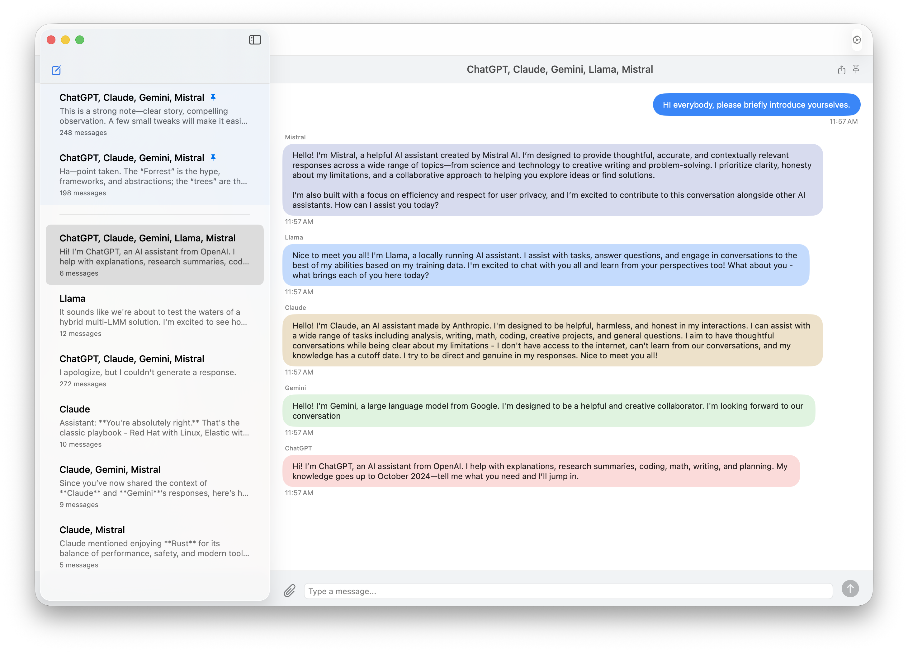

# Inter-LLM Ensemble Trust Platform (ILETP™)
  

Inter-LLM trust.  With the _**user**_ in control.

ILETP is an inter-LLM coordination platform that treats divergence as a **feature**, enabling models to interact, critique, and synthesize outputs with trust scoring and context continuity. It’s for people and organizations who need AI they can trust, not just hope, is right.

  <em>UI screenshot from preview inter-LLM chat application.  Code is included in this repo</em>

## ILETP Core Features
- Ensures multiple independent LLMs collaborate, evaluate each other, and reach trustworthy, auditable conclusions.
- Empowers user agency with real-time trust scores and escalation guidance; you decide when to trust AI vs. seek human expertise.
- Vendor-neutral, open, and model-agnostic design ensures compatibility with all major LLMs and deployment methods.

## Why Open Source
The problems addressed here, validation, trust, divergence, and diagnostics are not proprietary challenges. They are industry-wide challenges.

Open sourcing this work:

- prevents vendor lock-in  
- establishes public prior art  
- encourages experimentation and collaboration  
- supports safety and transparency goals  
- enables extensions and integrations by the broader community  

ILETP is an open platform, not a product.

  
## Example Usage
Several example use cases and an expanded use case concept are included in the repo.  These use cases are far from the only solutions that can be built by leveraging ILETP.

## How to Contribute
I welcome help! If you want to contribute:

1. Read CONTRIBUTING.md and CODE_OF_CONDUCT.md.  
2. Look for issues labeled "good first issue" or "help wanted".  
3. Open a new issue to discuss larger changes before starting.

_**NOTE**_: I'm not looking to maintain the Inter-LLM chat application code.  Feel free to fork it and use it as the basis for your experimentation.

## Support & Contact
- Open an issue for bugs and feature requests.  
- For direct contact: peter@iletp.org.

## Licensing
This repository uses two licenses:

- Code (source files): Apache License, Version 2.0 — see `LICENSE` in the repository root.
- Documentation and non-code content (vision, philosophy, business docs, etc.): Creative Commons Attribution 4.0 International (CC BY 4.0) — see `LICENSE-CC-BY-4.0.txt` in the repository root.

Per-file headers:
- Code files include an Apache SPDX header, e.g. `// SPDX-License-Identifier: Apache-2.0`.
- Markdown documentation files include a CC BY SPDX header as an HTML comment at the top,:
  `<!-- SPDX-License-Identifier: CC-BY-4.0 -->`
  `<!-- Copyright 2025 Peter Zan. Licensed under CC BY 4.0. See LICENSE-CC-BY-4.0.txt in the repository root. -->`

Notes:
- If you fork or reuse content, please keep existing copyright notices and license headers and follow the applicable license terms.
- GitHub may not show both licenses in the UI; this section is the canonical explanation for visitors.

## Finally...
This entire repository is a **starting point**, not the end game.  The idea of ILETP, and how it can improve trustworthiness of AI so it benefits all of us is the point.  Everything else here is open to evolution; nothing is untouchable.  The "tools" are here for you to take, share, and create.  Make something great!

